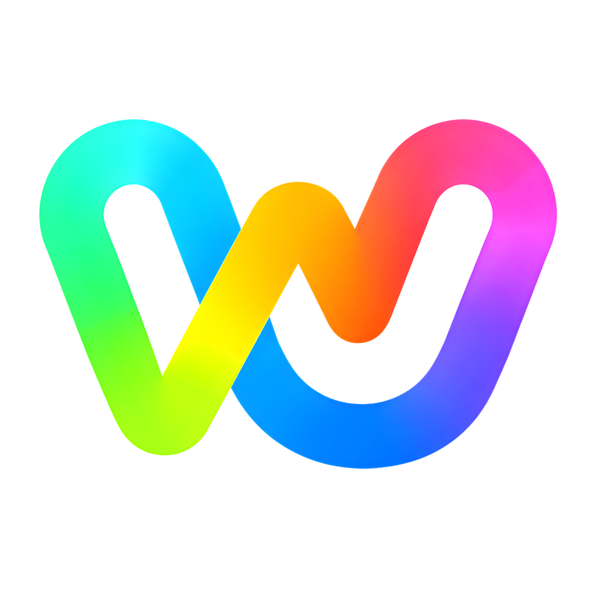

# Wavvy

### Immersive YouTube Music client for Android, with online radio

 

 

 

<b>📋 Table of Contents</b>

- [🧭 Overview](#overview)
- [🚧 Status](#status)
- [🖼️ Screenshots](#screenshots)
- [⚙️ Features](#features)
- [📥 Download Now](#download-now)
- [❓ FAQ](#faq)
- [🌍 Translations](#translations)
- [💖 Support the Project](#support-the-project)
- [✨ Special Thanks](#special-thanks)
- [📜 License](#license)
- [👥 Contributors](#contributors)
- [⚖️ Disclaimer](#disclaimer)

> [!WARNING]
> **Current Status** - Wavvy is being rebuilt from scratch 🚧. It already plays music, with the Home, the player, the queue, the lyrics, the search and the pages of albums, playlists and artists, but discover and the library are not there yet.
>
> **Regional Restriction** - If YouTube Music is unavailable in your region, this app won't work without a **VPN or proxy** connecting to a supported region.

---

<!-- OVERVIEW - Project overview -->

<h1>Overview</h1>
<em>Wavvy is an immersive YouTube Music client with online radio support, designed to be light, fluid and adaptive to any phone, for a premium listening experience.</em>

---

<!-- STATUS - Where the project is -->

<h1>Status</h1>

Wavvy is being rebuilt from the ground up, one small piece at a time, so every screen can be reviewed and tuned before the next one starts. An earlier version of the app was the base of the design and is used as a reference for the rebuild.

| Step | State |
| :--- | :--- |
| **Project base** (build, signed releases, automated release workflow, logo and icon) | ✅ Done, version 0.0.1 |
| **Theme** (colors, typography, shapes and spacing for every screen size) | ✅ Done, version 0.1.0 |
| **Navigation** (bottom bar in portrait, side rail in landscape) | ✅ Done, version 0.1.0 |
| **Welcome and sign in** (optional, only brings the profile photo) | ✅ Done, version 0.1.0 |
| **Profile menu** (account, sign out and shortcuts) | ✅ Done, version 0.2.0 |
| **Player** (playback in the background, mini player, full player, queue and lyrics) | ✅ Done, version 0.3.0 |
| **Home** (YouTube Music shelves, speed dial, recently played, quick picks and forgotten favorites) | 🚧 In progress, it plays songs and opens the pages of albums, playlists and artists, the library is still missing |
| **Local history** (what you listened to, pinned songs and the lyrics you picked, all on the device) | ✅ Done, version 0.4.0 |
| **Search** (suggestions, filters, results by kind, a search history that follows your account and a list of searches you may like) | ✅ Done, version 0.5.0, suggestions in 0.8.0 |
| **Pages** (albums, playlists and artists, with the artist subscription, the full lists of releases and who the artist is) | ✅ Done, version 0.6.0 |
| **Explore** (the tab with its big buttons and the pages behind them: new releases, charts with a country picker, moods and genres, and podcasts) | ✅ Done, version 0.9.0 |
| **Podcasts** (the page of a podcast with its filters and search, and the page of an episode with its description) | ✅ Done, version 0.9.0, downloads and saving come later |
| **Notifications** (new releases of the artists you follow, in an Activity screen, on the bell and as a system notification) | ✅ Done, version 0.8.0 |
| **Library** (the saved playlists, podcasts, songs, albums and artists with their order, search and grid, and the menus of each one) | 🚧 In progress, version 0.10.0, downloads, device files and profiles are still missing |
| **Playlists and likes** (save to a playlist from any menu, make, change and delete playlists with their cover, add songs, like songs) | ✅ Done, version 0.10.0 |
| Online radio | 🔜 Planned |
| Settings and history screen | 🔜 Planned |

---

<!-- SCREENSHOTS - Screenshots -->

<h1>Screenshots</h1>

<em>Screenshots will be added once the new screens are ready! 🚀</em>

---

<!-- FEATURES - Planned features -->

<h1>Features</h1>

Each feature shows whether it is already in the app (✅), being built (🚧) or still planned (🔜).

| Feature | Description | State |
| :--- | :--- | :---: |
| **🎵 YouTube Music** | Home shelves, search, the pages of albums, playlists and artists and playing songs work. Your library is coming. | 🚧 |
| **▶️ Player & Queue** | Mini player that grows into a full player, a queue that follows the radio of the song, with drag to reorder, swipe, search, selection of several songs and shuffle and repeat on the notification. | ✅ |
| **📝 Lyrics System** | Word by word, synchronized and plain lyrics from eight sources, a manual search, translation and options for the look and the order of the sources. | ✅ |
| **🕘 Local History** | Recently played songs, a speed dial with pins, quick picks and forgotten favorites, all built on the device. | ✅ |
| **💿 Albums, Playlists & Artists** | Pages with the cover blurred behind them, play, shuffle and a menu for the whole list, the artist page with subscription, the description in your language, birth, origin, genres and links, and the full lists of albums and singles with their filters. | ✅ |
| **🔎 Search** | Suggestions while you type, filters for songs, videos, albums, artists, playlists, podcasts and episodes, a search history that is the same one of your YouTube Music account and searches you may like. | ✅ |
| **🔔 Notifications** | Every twelve hours the app looks at the artists you follow and tells you about new albums, singles and EPs, in an Activity screen with a badge on the bell and in a notification of the system. | ✅ |
| **🕘 History Sync** | What you listen to here also goes to the history of your YouTube Music account. | ✅ |
| **📚 Library** | Your playlists, podcasts, channels, songs, albums and artists with the orders of YouTube Music, a search in the list, a list or a grid of covers, a button that opens on the last list you used, and the menu of each album and playlist. Downloads, files of the device and profiles are coming. | 🚧 |
| **➕ Playlists** | A sheet to save a song to your playlists that shows which ones already have it and stays open to save to several, a sheet to make and change a playlist with its 16:9 cover, a page for your playlists with the pencil, the description and a search to add songs, and removing a song from the playlist. | ✅ |
| **👍 Likes** | Like a song or an episode from the player and from its menu, it goes to your liked music and the lists follow it at once. | ✅ |
| **🧭 Explore** | A tab drawn after the Explore page of YouTube Music, with new releases, charts of videos and artists for every country, moods and genres with their pages, podcasts and what is trending, each row stopping on a card as you scroll. | ✅ |
| **🎙️ Podcasts** | The page of a podcast with its cover, description, filters, order and a search among its episodes, the page of an episode with its numbers and full description, and the progress of an episode that follows your YouTube Music account. | ✅ |
| **📻 Online Radio** | Tune into radio stations from around the world. | 🔜 |
| **📺 Lives & Podcasts** | Live streams and podcast episodes. | 🔜 |
| **🔓 Optional Sign In** | Use the app without an account, or sign in with Google to show your profile photo. | ✅ |
| **✨ Fluid UI/UX** | Immersive, minimalist design with fluid animations, powered by Material 3. | ✅ |
| **📱 Made for Every Phone** | Layouts that adapt to the screen size instead of fixed sizes, and a light APK. | ✅ |
| **🌍 Localization** | Portuguese (Brazil) and English, following the language of the device. | ✅ |

 

<em>Built with <b>Kotlin</b> and <b>Jetpack Compose</b> for a native Android experience that feels fast, responsive and beautiful.</em>

---

<!-- DOWNLOAD - Downloads -->

<h1>Download Now</h1>

A new release with signed APKs is published on GitHub every time the app version changes. Pick the one that matches your phone:

| APK | When to use it |
| :--- | :--- |
| **universal** | Works on any device, larger file. Pick this one if unsure. |
| **arm64-v8a** | Most phones from 2017 onwards. |
| **armeabi-v7a** | Older 32-bit devices. |

While the version starts with `0.`, releases are marked as pre-releases.

---

<!-- FAQ - Frequently asked questions -->

<h1>FAQ</h1>

> **Note:** As Wavvy is still in active development, this FAQ section is incomplete and will be updated as we progress. 🚀

  
<b>Is Wavvy free to use?</b>

   
  Yes, Wavvy is completely free and open-source. There are no premium subscriptions or hidden costs.

  
<b>Do I need a Google account?</b>

   
  No. You can use Wavvy without an account. Signing in is optional and will unlock your library, likes and personalized recommendations.

  
<b>Why do I need a VPN/Proxy in some regions?</b>

   
  Wavvy acts as a client for YouTube Music. If the service is restricted by Google in your country, our app inherits those same regional limitations.

  
<b>Is the app ready to use?</b>

   
  Not yet. Wavvy is being rebuilt from scratch, one piece at a time, and each screen arrives after being reviewed on a real phone. It already plays music with the Home, the search, the pages of albums, playlists and artists, the player, the queue and the lyrics, but discover and the library are still missing. See the <a href="#status">Status</a> section.

  
<b>Which APK should I download?</b>

   
  If you are not sure, take the <b>universal</b> one. Phones from 2017 onwards can use <b>arm64-v8a</b>, and older 32-bit devices need <b>armeabi-v7a</b>.

  
<b>Why are there no screenshots yet?</b>

   
  Because I'm a bit stubborn and can't stop tweaking the UI (no, it's totally not OCD, *cough cough* :D). It's better to hold off on screenshots until the design actually settles down.

  
<b>Where is the contributing document?</b>

   
  Currently, it only exists in my head! I will write down a proper guide once the project hits a more complete version and is ready for public collaboration.

  
<b>Does Wavvy collect my personal data?</b>

   
  No, Wavvy has no server of its own and does not track you. What you listened to, the songs you pinned and the lyrics you picked are kept <b>only on your device</b>, to build the sections of the Home, and never leave it. Like any client of other services, the app does talk to them: YouTube Music for the songs, the lyrics services (the title and the artist of the song are sent so they can find the lyrics) and Google Translate when you turn the translation of the lyrics on (the text of the lyrics is sent to translate it). If you sign in with Google, only your profile photo is kept.

  
<b>Can I import my playlists from other services?</b>

   
  We are working on bringing more synchronization features in future updates. Stay tuned!

<h3>More questions? <a href="https://github.com/Zev-Kaapor/Wavvy/issues">Open an issue on GitHub!</a></h3>

---

<!-- TRANSLATIONS - Translations -->

<h1>Translations</h1>

<h3>Help us bring Wavvy to more people! 🌍</h3>

  Wavvy speaks <strong>Portuguese (Brazil)</strong> and <strong>English</strong> for now. If your device is set to Portuguese (Brazil) the app uses it, any other language falls back to English.

  <strong>Weblate coming soon</strong> • <a href="https://github.com/Zev-Kaapor/Wavvy/issues/new">Open an issue to contribute</a>

---

<!-- SUPPORT - Support the project -->

<h1>Support the Project</h1>

<h3>Wavvy is free and open-source. If the app brings joy to your life, consider supporting its development! ❤️</h3>

&nbsp; | &nbsp;

---

<!-- ACKNOWLEDGMENTS - Special thanks -->

<h1>Special Thanks</h1>

<h3>Wavvy stands on the shoulders of incredible open-source work!</h3>

<h3>Main Inspirations</h3>

<table>
  <thead>
    <tr>
      <th align="center">Project</th>
      <th align="center">Author</th>
    </tr>
  </thead>
  <tbody>
    <tr>
      <td><strong>Metrolist</strong></td>
      <td><a href="https://github.com/MetrolistGroup">MetrolistGroup</a></td>
    </tr>
    <tr>
      <td><strong>RiPlay & RiMusic</strong></td>
      <td><a href="https://github.com/fast4x">fast4x</a></td>
    </tr>
    <tr>
      <td colspan="2" align="center"><em>and more amazing open-source projects</em></td>
    </tr>
  </tbody>
</table>

<h3>Thanks to Google</h3>

Thank you to Google, especially to <strong>YouTube Music</strong>, the service whose music Wavvy brings to a lighter and more fluid app, and to <strong>Gemini</strong>, whose colors inspired the look of Wavvy. 
<em>Wavvy is an independent project and is not affiliated with or endorsed by Google.</em>

<h3>Core Technologies</h3>

<table>
  <thead>
    <tr>
      <th align="center">Library/Tool</th>
      <th align="center">Contribution</th>
    </tr>
  </thead>
  <tbody>
    <tr>
      <td><strong>innertubex</strong> (MetrolistGroup)</td>
      <td>Finds the audio of each song, the core of the extraction engine</td>
    </tr>
    <tr>
      <td><strong>Media3 (ExoPlayer)</strong></td>
      <td>Playback in the background, the queue and the media notification</td>
    </tr>
    <tr>
      <td><strong>Jetpack Compose</strong></td>
      <td>Modern, fluid Android UI framework</td>
    </tr>
    <tr>
      <td><strong>Material Design 3</strong></td>
      <td>Design system and dynamic theming</td>
    </tr>
    <tr>
      <td><strong>Room, Ktor, OkHttp & Coil</strong></td>
      <td>Local history, network requests and image loading</td>
    </tr>
    <tr>
      <td><strong>MusicBrainz</strong></td>
      <td>Birth, origin, genres and links of the artists, an open database</td>
    </tr>
    <tr>
      <td><strong>Reorderable</strong> (Calvin-LL)</td>
      <td>Dragging the songs of the queue</td>
    </tr>
  </tbody>
</table>

<h3>Lyrics Services</h3>

The lyrics come from <strong>BetterLyrics</strong>, <strong>Paxsenix</strong>, <strong>LyricsPlus</strong>, <strong>LrcLib</strong>, <strong>KuGou</strong>, <strong>Zemer</strong> and the lyrics and captions of <strong>YouTube Music</strong>, and the translation uses the public endpoint of <strong>Google Translate</strong>, as RiMusic does. Thank you to everyone who keeps them open!

<h3>Thank you to the entire open-source community! Every library and tool that powers this project!</h3>

---

<!-- LICENSE - License -->

<h1>License</h1>

Wavvy is licensed under the **GNU General Public License v3.0**, see the [LICENSE](LICENSE) file. The projects that inspire it are also GPL-3.0, and any code adapted from them keeps its credit.

---

<!-- CONTRIBUTORS - Contributors -->

<h1>Contributors</h1>

<h3>This project wouldn't exist without these amazing people!</h3>

<h5>Want to contribute? A contribution guide is coming soon, until then <a href="https://github.com/Zev-Kaapor/Wavvy/issues">open an issue</a>!</h5>

---

<!-- DISCLAIMER - Legal notice -->

<h1>Disclaimer</h1>

Wavvy is an open-source, non-commercial project developed for educational and personal use. This project is **not affiliated with, funded, authorized, endorsed by, or associated** with YouTube, Google LLC, or any of their affiliates and subsidiaries.

All trademarks, service marks, and intellectual property rights referenced in this project belong to their respective owners. Wavvy does not host, store, or distribute any copyrighted media; it functions strictly as a client interface for publicly available content provided via third-party APIs.

---

 

**Made with 💙 by [Zev Kaapor](https://github.com/Zev-Kaapor)**

**Status: Rebuilding 🚧**

